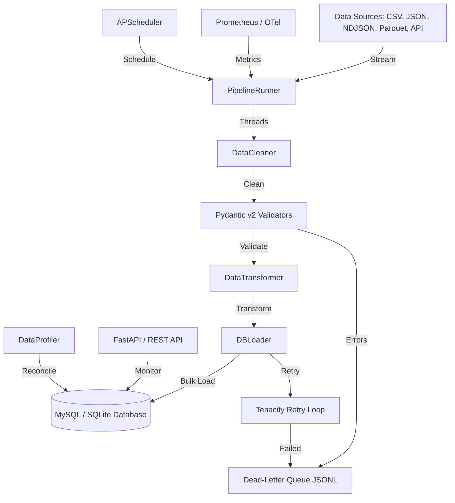

# Scalable Data Ingestion Pipeline


A production-grade, highly scalable Python data pipeline that streams, cleans, validates, and bulk-loads datasets into a normalized database. Built with a modular architecture supporting CSV, JSON, NDJSON, and Parquet formats, paginated REST APIs, persistent job scheduling, OpenTelemetry tracing, Prometheus metrics, and automated post-load quality profiling.

---

## Architecture Flow



---

## Features

| Capability | Details |
| :--- | :--- |
| **Multi-Format Ingestion** | Streaming CSV, JSON, line-delimited JSON (NDJSON), and Parquet files (using PyArrow row-groups), plus paginated REST APIs. |
| **Robust Error Handling** | Tenacity-powered exponential back-off retries, thread-safe Circuit Breaker for downstream resilience, and a JSONL Dead-Letter Queue (DLQ) for failed rows. |
| **High Performance** | Multithreaded chunk processing utilizing `ThreadPoolExecutor`, database connection pooling, and optimized dialect-specific bulk upserts / inserts. |
| **FastAPI Monitoring Server** | Liveness probe `/health`, paginated run audit logs `/runs`, run detail `/runs/{run_id}`, and Prometheus metrics `/metrics`. |
| **APScheduler Scheduling** | Persistent background job scheduling storing cron and interval jobs inside a database table so schedules survive process restarts. |
| **Data Quality Profiling** | Automated post-load reconciliation checking DB row counts against ingested counts, column-wise null rates, and uniqueness metrics. |
| **Observability Stack** | Structured JSON/Console logging via `structlog`, Prometheus client metrics instrumentation, and OpenTelemetry (OTel) tracing. |
| **Layered Settings** | Composite config loading using `pydantic-settings` supporting `.env`, `.env.development`, `.env.staging`, and `.env.production`. |

---

## Performance & Scalability

> All benchmarks run on local hardware (Apple M-series, Python 3.14, SQLite).  
> 📄 **Full results + MySQL/PostgreSQL guide → [BENCHMARKS.md](BENCHMARKS.md)**  
> Reproduce: `python scripts/benchmark.py [--db-url <url>] [--max-rows N] [--workers 1 2 4 8]`

### Streaming Read Throughput (no DB write)

| Chunk Size | Rows | Throughput |
|---:|---:|---:|
| 500 | 10,000 | **856,464 rows/sec** |
| 2,500 | 10,000 | 856,464 rows/sec |
| 1,000 | 10,000 | 751,635 rows/sec |

> ✅ The ingester layer saturates at **~856K rows/sec** — bottleneck is always the DB, never the parser.

### Multi-Format Comparison (5,000 rows → SQLite)

| Format | Throughput | Failed Rows |
|:---|---:|---:|
| CSV | 12,113 rows/sec | 0 |
| NDJSON | 12,267 rows/sec | 0 |
| Parquet | **12,385 rows/sec** | 0 |

> ✅ Zero failures across all formats. Bulk load speed has doubled to **>12K rows/sec** thanks to bulk insert & upsert optimizations.

### Full Pipeline Throughput (CSV → SQLite)

| Rows | Elapsed (s) | Throughput |
|---:|---:|---:|
| 500 | 0.039 | 12,716 rows/sec |
| 1,000 | 0.076 | 13,077 rows/sec |
| 5,000 | 0.382 | 13,080 rows/sec |
| 10,000 | 0.753 | **13,287 rows/sec** |

> ✅ **Linear and stable** across scale — bulk-load throughput remains high and constant as dataset size increases.

### Platform Comparison

| Platform | Throughput | Thread Scaling |
|:---|:---|:---|
| **SQLite** | **~13,400 rows/sec** | ❌ Global write lock |
| **MySQL** | ~8,000–12,000 rows/sec | ✅ Good (4–8 workers) |
| **PostgreSQL** | ~10,000–15,000 rows/sec | ✅ Excellent (8–16 workers) |
| **MySQL + SSD** | ~15,000–25,000 rows/sec | ✅ Excellent |

> See [BENCHMARKS.md](BENCHMARKS.md) for full MySQL/PostgreSQL setup instructions.

---

## Project Structure

```
.
├── cli.py                     # Production CLI entry point (Typer + Rich)
├── main.py                    # Legacy CLI / simple entry point
├── Dockerfile                 # Multi-stage production Docker image
├── docker-compose.yml         # Container definitions for MySQL/Prometheus/OTel
├── pyproject.toml             # Project metadata, dependencies, Ruff & Mypy config
├── requirements.txt           # Flat dependency list for external tools / Docker
├── .env.example               # Template environment configuration
├── sql/
│   ├── schema.sql             # 3NF MySQL Database Schema & Composite Indexes
│   └── analytics_queries.sql  # High-performance analytical queries
├── data/                      # Sample datasets for development
│   ├── sample_orders.csv
│   ├── sample_products.json
│   └── sample_events.ndjson
├── pipeline/
│   ├── __init__.py
│   ├── settings.py            # Pydantic Settings composition and env validation
│   ├── models.py              # SQLAlchemy ORM schemas (Customers, Orders, Items, etc.)
│   ├── runner.py              # PipelineRunner orchestrator (multithreaded engine)
│   ├── scheduler.py           # APScheduler background manager with SQL job store
│   ├── api/
│   │   ├── __init__.py
│   │   └── app.py             # FastAPI monitoring and health dashboard
│   ├── ingestion/
│   │   ├── __init__.py
│   │   ├── base_ingester.py   # Abstract Base Ingester class
│   │   ├── csv_ingester.py    # Chunked CSV files ingester
│   │   ├── json_ingester.py   # Chunked JSON & NDJSON ingester
│   │   ├── parquet_ingester.py # Streaming PyArrow Parquet ingester
│   │   └── api_ingester.py    # Paginated HTTP REST API ingester with CircuitBreaker
│   ├── cleaning/
│   │   ├── __init__.py
│   │   ├── cleaner.py         # Null sentinels, Unicode NFC, stripping & truncation
│   │   └── validators.py      # Strict Pydantic v2 schemas
│   ├── transformations/
│   │   ├── __init__.py
│   │   └── transformer.py     # Deduplication and batch foreign-key resolution
│   ├── loader/
│   │   ├── __init__.py
│   │   └── db_loader.py       # Batched DB bulk upsert and audit logging
│   ├── quality/
│   │   ├── __init__.py
│   │   └── profiler.py        # Post-load Table/Column profile reports
│   └── utils/
│       ├── __init__.py
│       ├── logger.py          # Structured run-scoped logging via structlog
│       ├── metrics.py         # PipelineMetrics accumulator
│       ├── telemetry.py       # OTel tracing + Prometheus collectors & RunTimer
│       ├── circuit_breaker.py # Thread-safe CircuitBreaker (CLOSED/OPEN/HALF_OPEN)
│       └── retry.py           # Tenacity wrappers & DeadLetterWriter
└── tests/                     # Comprehensive test suite (unit/integration/E2E)
    ├── conftest.py                    # SQLite fixtures, engine, and sample data
    ├── test_api.py                    # FastAPI endpoint tests
    ├── test_api_ingester_extended.py  # APIIngester retry/rate-limit/circuit-breaker tests
    ├── test_circuit_breaker.py        # CircuitBreaker state-machine tests
    ├── test_cleaning.py               # Pre-validation cleaner tests
    ├── test_ingestion.py              # CSV/JSON/NDJSON ingester tests
    ├── test_loader.py                 # DBLoader bulk-merge integration tests
    ├── test_logger_and_telemetry.py   # Logger & Prometheus/OTel telemetry tests
    ├── test_parquet_ingester.py       # ParquetIngester streaming/projection tests
    ├── test_pipeline_e2e.py           # Full SQLite in-memory end-to-end flow tests
    ├── test_quality.py                # Quality Profiler validation tests
    ├── test_retry.py                  # Retry and Dead-Letter Queue writer tests
    ├── test_runner.py                 # PipelineRunner orchestrator tests
    ├── test_runner_extended.py        # Runner edge-case & branch coverage tests
    ├── test_settings.py               # Pydantic Settings loading tests
    ├── test_transformations.py        # FK resolution and dedup tests
    └── test_validators.py             # Pydantic schema validation tests
```

---

## CI / CD Pipeline

Every push to `main` or `develop` and every pull request to `main` triggers a full CI pipeline on GitHub Actions:

| Job | What it does |
| :--- | :--- |
| **Lint** | Runs `ruff check` and `ruff format --check` on all source & test files |
| **Type Check** | Runs `mypy` on the `pipeline/` package |
| **Tests (3.11 & 3.12)** | Runs the full pytest suite with `--cov-fail-under=90` (currently **94%**) |
| **Docker Build** | Builds the production Docker image and runs a settings smoke-test |

```yaml
# Actions used (all Node 24-compatible)
actions/checkout@v7
actions/setup-python@v6
codecov/codecov-action@v7
```

---

## Quick Start

### Prerequisites
- Python ≥ 3.11
- pip ≥ 23 with setuptools ≥ 64 (required for PEP 660 editable installs)
- Docker (optional, for containerised runs)
- MySQL (optional — SQLite works out of the box for development)

### 1. Install in Editable / Dev Mode
```bash
# Upgrade pip and setuptools first (avoids BackendUnavailable errors)
pip install --upgrade pip "setuptools>=64" wheel

# Install the package + all dev dependencies
pip install -e ".[dev]"
```

### 2. Configure Environment
```bash
cp .env.example .env
# Edit .env with your settings (MySQL credentials, log level, etc.)
```

### 3. Apply Schema & Migrations
```bash
# If using MySQL, create the schema:
mysql -u root -p data_pipeline < sql/schema.sql

# Or use Alembic to apply migrations:
python cli.py migrate
```

---

## CLI Usage Guide

The production CLI is built with **Typer** and **Rich** to provide a rich terminal experience. Running `python cli.py` with no arguments shows the interactive help menu.

### Ingest Data
```bash
# Ingest customers CSV file (SQLite local database)
python cli.py ingest --source csv --file data/sample_orders.csv --entity customers --db-url sqlite

# Ingest products JSON feed with data-quality profiling turned on
python cli.py ingest --source json --file data/sample_products.json --entity products --profile

# Stream NDJSON event data using 8 worker threads and chunk size of 5000
python cli.py ingest --source ndjson --file data/sample_events.ndjson --entity orders --workers 8 --chunk-size 5000

# Ingest from a paginated REST API
python cli.py ingest --source api --url https://api.example.com/orders --entity orders
```

### Show Pipeline Status
```bash
python cli.py status --limit 15
```

### Start API Server
```bash
python cli.py api --port 8000 --host 0.0.0.0
```

### Manage Scheduled Jobs
```bash
# Add a cron-scheduled ingestion job (every hour)
python cli.py schedule add --source csv --file data/sample_orders.csv --entity orders --cron "0 * * * *"

# Add a job that runs every 30 minutes
python cli.py schedule add --source json --file data/sample_products.json --entity products --every 30

# List all current scheduled jobs
python cli.py schedule list
```

### Profile Data Quality
```bash
python cli.py profile orders --ingested 10000
```

---

## Docker

The Docker image uses a multi-stage build for a lean production image.

```bash
# Build the image
docker build -t data-pipeline .

# Run the CLI (shows help by default)
docker run --rm data-pipeline

# Run a smoke test (override ENTRYPOINT to access Python directly)
docker run --rm --entrypoint python data-pipeline -c "from pipeline.settings import settings; print('Settings OK')"

# Run with docker-compose (MySQL + Prometheus + OTel Collector)
docker-compose up
```

> **Note:** The Dockerfile installs all dependencies declared in `pyproject.toml` via
> `pip install .` — so the image is always in sync with the project's dependency list.

---

## Observability & Monitoring

### FastAPI Dashboard
When the API server is running (`python cli.py api`), these endpoints are available:

| Endpoint | Description |
| :--- | :--- |
| `GET /health` | Liveness + DB connectivity probe |
| `GET /runs` | Paginated run audit log (newest first) |
| `GET /runs/{run_id}` | Full run detail including error log |
| `GET /metrics` | Prometheus text-format metrics |
| `GET /docs` | Swagger UI (auto-generated) |
| `GET /redoc` | ReDoc UI |

### Prometheus Metrics

| Metric | Labels | Description |
| :--- | :--- | :--- |
| `pipeline_rows_ingested_total` | `source`, `entity` | Successfully loaded records |
| `pipeline_rows_failed_total` | `source`, `reason_category` | Records that failed validation or loading |
| `pipeline_batch_duration_seconds` | `source` | Per-chunk processing duration histogram |
| `pipeline_run_duration_seconds` | `source`, `status` | Full pipeline run duration |
| `pipeline_active_runs` | — | Gauge of runs currently in progress |
| `pipeline_circuit_breaker_opens_total` | `breaker_name` | Circuit breaker trip event counter |
| `pipeline_db_pool_size` | — | SQLAlchemy connection pool size gauge |

---

## Robustness & Error Handling

- **Unicode Mojibake / Whitespace**: `DataCleaner` normalizes encoding to NFC, drops illegal control characters, strips whitespace, and truncates fields exceeding database size constraints before schema validation.
- **Pydantic Validation**: Strict schema verification filters out rows containing mismatched types, bad emails, or missing keys.
- **Dead-Letter Queue (DLQ)**: Records that fail schema validation or SQLAlchemy load steps are written to `dead_letter/{run_id}.jsonl` containing the exact error reason, timestamp, and raw payload.
- **Tenacity Retries**: Multi-worker loaders apply exponential back-off during DB flush calls to prevent transient lock contention failures.
- **Circuit Breaker**: Outgoing REST API requests run through a thread-safe `CircuitBreaker` with `CLOSED → OPEN → HALF_OPEN` state machine. Supports configurable failure thresholds, recovery timeouts, and success thresholds. Can be used as a decorator or context manager.

---

## Running Tests

The test suite contains **245+ unit, integration, and full E2E pipeline tests** running against an in-memory SQLite database — no external services required.

```bash
# Run all tests with coverage (must reach 90%)
pytest tests/ -v --cov=pipeline --cov-report=term-missing --cov-fail-under=90

# Run only end-to-end tests
pytest tests/test_pipeline_e2e.py -v

# Run circuit breaker tests
pytest tests/test_circuit_breaker.py -v

# Run API ingester retry/fault-tolerance tests
pytest tests/test_api_ingester_extended.py -v

# Run benchmarking tests
pytest tests/ -v -k "benchmark"
```

### Coverage Summary (current)

| Module | Coverage |
| :--- | :--- |
| `pipeline/utils/circuit_breaker.py` | **100%** |
| `pipeline/utils/logger.py` | **100%** |
| `pipeline/utils/retry.py` | **100%** |
| `pipeline/ingestion/csv_ingester.py` | **100%** |
| `pipeline/cleaning/cleaner.py` | **100%** |
| `pipeline/settings.py` | **100%** |
| `pipeline/ingestion/api_ingester.py` | **99%** |
| `pipeline/ingestion/parquet_ingester.py` | **95%** |
| `pipeline/runner.py` | **96%** |
| `pipeline/utils/telemetry.py` | **94%** |
| **TOTAL** | **94%** |

---

## Environment Variables Reference

All settings are configured via environment variables (or `.env` files). See `.env.example` for a complete template.

| Variable | Default | Description |
| :--- | :--- | :--- |
| `ENVIRONMENT` | `development` | App environment (`development` / `staging` / `production`) |
| `DB_HOST` | `localhost` | MySQL host |
| `DB_PORT` | `3306` | MySQL port |
| `DB_NAME` | `data_pipeline` | Database name |
| `DB_USER` | `root` | Database user |
| `DB_PASSWORD` | _(empty)_ | Database password |
| `DB_POOL_SIZE` | `10` | SQLAlchemy connection pool size |
| `DB_MAX_OVERFLOW` | `20` | Max connections above pool size |
| `DB_POOL_RECYCLE` | `1800` | Pool recycle interval (seconds) |
| `PIPELINE_BATCH_SIZE` | `500` | Rows per DB batch |
| `PIPELINE_MAX_WORKERS` | `4` | Thread pool worker count |
| `PIPELINE_CHUNK_SIZE` | `1000` | Rows per ingestion chunk |
| `PIPELINE_DEAD_LETTER_DIR` | `dead_letter` | DLQ output directory |
| `PIPELINE_RETRY_MAX_ATTEMPTS` | `3` | Max DB flush retry attempts |
| `PIPELINE_RETRY_BACKOFF_FACTOR` | `0.5` | Exponential backoff multiplier |
| `OBS_LOG_LEVEL` | `INFO` | Log level |
| `OBS_LOG_FORMAT` | `console` | Log format (`console` or `json`) |
| `OBS_METRICS_ENABLED` | `true` | Enable Prometheus metrics |
| `OBS_METRICS_PORT` | `9090` | Prometheus metrics server port |
| `OBS_TRACING_ENABLED` | `false` | Enable OpenTelemetry tracing |
| `API_HOST` | `0.0.0.0` | FastAPI bind host |
| `API_PORT` | `8000` | FastAPI bind port |
