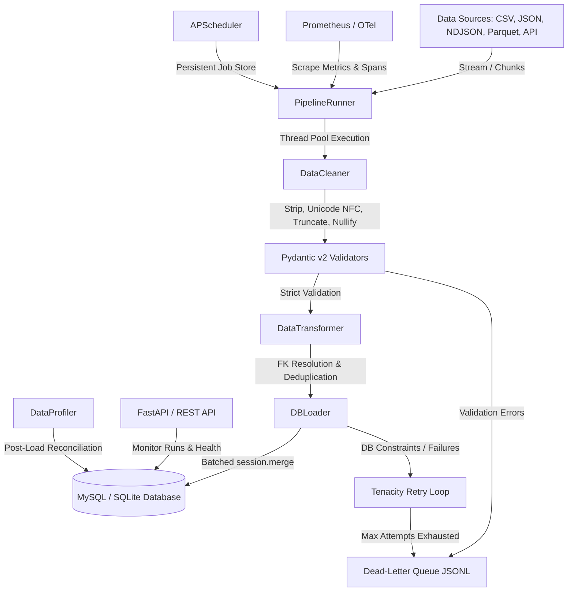

# Scalable Data Ingestion Pipeline

A production-grade, highly scalable Python data pipeline that streams, cleans, validates, and bulk-loads datasets into a normalized database. Built with a modular architecture supporting CSV, JSON, NDJSON, and Parquet formats, paginated REST APIs, persistent job scheduling, OpenTelemetry tracing, Prometheus metrics, and automated post-load quality profiling.

---

## Architecture Flow



---

## Features

| Capability | Details |
| :--- | :--- |
| **Multi-Format Ingestion** | Streaming CSV, JSON, line-delimited JSON (NDJSON), and Parquet files (using PyArrow row-groups), plus paginated REST APIs. |
| **Robust Error Handling** | Tenacity-powered exponential back-off retries, thread-safe Circuit Breaker for downstream resilience, and a JSONL Dead-Letter Queue (DLQ) for failed rows. |
| **High Performance** | Multithreaded chunk processing utilizing `ThreadPoolExecutor`, database connection pooling, and optimized batched `session.merge()` bulk loading. |
| **FastAPI Monitoring Server** | Liveness probe `/health`, paginated run audit logs `/runs`, run detail `/runs/{run_id}`, and Prometheus metrics `/metrics`. |
| **APScheduler Scheduling** | Persistent background job scheduling storing cron and interval jobs inside a database table so schedules survive process restarts. |
| **Data Quality Profiling** | Automated post-load reconciliation checking DB row counts against ingested counts, column-wise null rates, and uniqueness metrics. |
| **Observability Stack** | Structured JSON/Console logging via `structlog`, Prometheus client metrics instrumentation, and OpenTelemetry (OTel) tracing. |
| **Layered Settings** | Composite config loading using `pydantic-settings` supporting `.env`, `.env.development`, `.env.staging`, and `.env.production`. |

---

## Project Structure

```
.
├── cli.py                     # Production CLI entry point (Typer + Rich)
├── main.py                    # Legacy CLI / simple entry point
├── Dockerfile                 # Multi-stage production Docker image
├── docker-compose.yml         # Container definitions for MySQL/Prometheus/OTel
├── pyproject.toml             # Project metadata, Ruff & Mypy configurations
├── requirements.txt           # Lockfile for external dependencies
├── .env.example               # Template environment configuration
├── sql/
│   ├── schema.sql             # 3NF MySQL Database Schema & Composite Indexes
│   └── analytics_queries.sql  # High-performance analytical queries
├── data/                      # Sample datasets for development
│   ├── sample_orders.csv
│   ├── sample_products.json
│   └── sample_events.ndjson
├── pipeline/
│   ├── __init__.py
│   ├── config.py              # Backward-compatible DB configuration helper
│   ├── settings.py            # Pydantic Settings composition and env validation
│   ├── models.py              # SQLAlchemy ORM schemas (Customers, Orders, Items, etc.)
│   ├── runner.py              # PipelineRunner orchestrator (multithreaded engine)
│   ├── scheduler.py           # APScheduler background manager with SQL job store
│   ├── api/
│   │   ├── __init__.py
│   │   └── app.py             # FastAPI monitoring and health dashboard
│   ├── ingestion/
│   │   ├── __init__.py
│   │   ├── base_ingester.py   # Abstract Base Ingester class
│   │   ├── csv_ingester.py    # Chunked CSV files ingester
│   │   ├── json_ingester.py   # Chunked JSON & NDJSON ingester
│   │   ├── parquet_ingester.py # Streaming PyArrow Parquet ingester
│   │   └── api_ingester.py    # Paginated HTTP REST API ingester
│   ├── cleaning/
│   │   ├── __init__.py
│   │   ├── cleaner.py         # Null sentinels, Unicode NFC, stripping & truncation
│   │   └── validators.py      # Strict Pydantic v2 schemas
│   ├── transformations/
│   │   ├── __init__.py
│   │   └── transformer.py     # Deduplication and batch foreign-key resolution
│   ├── loader/
│   │   ├── __init__.py
│   │   └── db_loader.py       # Batched DB bulk upsert and audit logging
│   └── quality/
│   │   ├── __init__.py
│   │   └── profiler.py        # Post-load Table/Column profile reports
│   └── utils/
│       ├── __init__.py
│       ├── logger.py          # Structured run-scoped logging via structlog
│       ├── metrics.py         # PipelineMetrics accumulator
│       ├── telemetry.py       # OTel tracing hook + Prometheus collectors
│       ├── circuit_breaker.py # Thread-safe CircuitBreaker for external I/O
│       └── retry.py           # Tenacity wrappers & DeadLetterWriter
└── tests/                     # Comprehensive testing suite (unit/integration/E2E)
    ├── conftest.py            # SQLite fixtures, engine, and sample data generator
    ├── test_ingestion.py      # Ingester test cases
    ├── test_cleaning.py       # Pre-validation cleaner tests
    ├── test_validators.py     # Pydantic schema validation tests
    ├── test_transformations.py # FK resolution and dedup tests
    ├── test_loader.py         # DBLoader bulk-merge integration tests
    ├── test_runner.py         # Orchestrator test cases
    ├── test_settings.py       # Pydantic Settings loading tests
    ├── test_quality.py        # Quality Profiler validation tests
    ├── test_retry.py          # Retry and Dead-Letter Queue writer tests
    └── test_pipeline_e2e.py   # Full SQLite in-memory end-to-end flow tests
```

---

## Quick Start

### 1. Install Dependencies
```bash
pip install -r requirements.txt
```

### 2. Configure Environment
```bash
cp .env.example .env
# Edit .env with your configuration settings (MySQL credentials, log level, etc.)
```

### 3. Apply Schema & Migrations
```bash
# If using MySQL, create the schema:
mysql -u root -p data_pipeline < sql/schema.sql

# Or use Alembic to apply migrations:
python cli.py migrate
```

---

## CLI Usage Guide

The production CLI is built with **Typer** and **Rich** to provide a rich terminal experience. Running `python cli.py` with no arguments will show the interactive help menu.

### Ingest Data
Ingest dataset files or API endpoints directly into the database.
```bash
# Ingest customers CSV file (SQLite local database)
python cli.py ingest --source csv --file data/sample_orders.csv --entity customers --db-url sqlite

# Ingest products JSON feed with data-quality profiling turned on
python cli.py ingest --source json --file data/sample_products.json --entity products --profile

# Stream NDJSON event data using 8 worker threads and chunk size of 5000
python cli.py ingest --source ndjson --file data/sample_events.ndjson --entity orders --workers 8 --chunk-size 5000
```

### Show Pipeline Status
Show a formatted audit log of recent pipeline runs directly from the database.
```bash
python cli.py status --limit 15
```

### Start API Server
Launch the FastAPI monitoring API.
```bash
python cli.py api --port 8000 --host 0.0.0.0
```

### Manage Scheduled Jobs
Manage persistent APScheduler jobs stored in your database.
```bash
# Add a scheduled ingestion job running on a cron schedule
python cli.py schedule add --source csv --file data/sample_orders.csv --entity orders --cron "0 * * * *"

# Add a scheduled job running every 30 minutes
python cli.py schedule add --source json --file data/sample_products.json --entity products --every 30

# List all current scheduled jobs
python cli.py schedule list
```

### Profile Data Quality
Generate a detailed post-load quality report for any database table.
```bash
python cli.py profile orders --ingested 10000
```

---

## Observability & Monitoring

### FastAPI Dashboard
When the API server is running (`python cli.py api`), the following endpoints are available:
- **`GET /health`**: Health status probe checking general connectivity and database reachability.
- **`GET /runs`**: Paginated summaries of recent runs including ingested/failed counts and duration.
- **`GET /runs/{run_id}`**: Detailed information on a specific pipeline run, containing full exception error logs if failures occurred.
- **`GET /metrics`**: Prometheus-formatted text metrics.
- **`GET /docs`**: Automated interactive API documentation (Swagger UI).

### Prometheus Metrics
If metrics are enabled, the pipeline instruments the following metrics:
- `pipeline_rows_ingested_total` (Labels: `source`, `entity`): Successfully loaded records.
- `pipeline_rows_failed_total` (Labels: `source`, `reason_category`): Records that failed validation or loading.
- `pipeline_batch_duration_seconds` (Labels: `source`): Ingestion execution duration histogram.
- `pipeline_run_duration_seconds` (Labels: `source`, `status`): Full pipeline execution time.
- `pipeline_active_runs`: Gauge of runs currently in progress.
- `pipeline_circuit_breaker_opens_total` (Labels: `breaker_name`): Count of circuit breaker trip events.

---

## Robustness & Error Handling

- **Unicode Mojibake / Whitespace**: `DataCleaner` normalizes encoding to NFC, drops illegal control characters, strips whitespace, and truncates fields exceeding database size constraints before schema validation.
- **Pydantic Validation**: Strict schema verification filters out rows containing mismatched types, bad emails, or missing keys. Valid records pass to transformations; invalid records bypass execution.
- **Dead-Letter Queue (DLQ)**: Records that fail schema validation or SQLAlchemy load steps are written to `dead_letter/{run_id}.jsonl` containing the exact error reason, timestamp, and raw payload.
- **Tenacity Retries**: Multi-worker loaders apply a thread-safe exponential back-off strategy during database flush calls to prevent transient lock contention failures.
- **Circuit Breaker**: Outgoing REST API requests run through a thread-safe `CircuitBreaker`. If downstream APIs throw repeated failures, the breaker opens, instantly throwing `CircuitOpenError` to prevent wasting resources and allow downstream recovery.

---

## Running Tests

The test suite contains unit, integration, and full E2E pipeline tests. All tests run against an in-memory SQLite database instance by default, requiring no external databases to run.

```bash
# Run all tests with coverage reports
pytest tests/ -v --cov=pipeline --cov-report=term-missing

# Run only E2E tests
pytest tests/test_pipeline_e2e.py -v

# Run benchmarking tests
pytest tests/ -v -k "benchmark"
```
